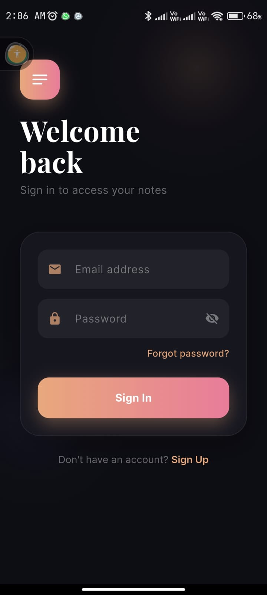
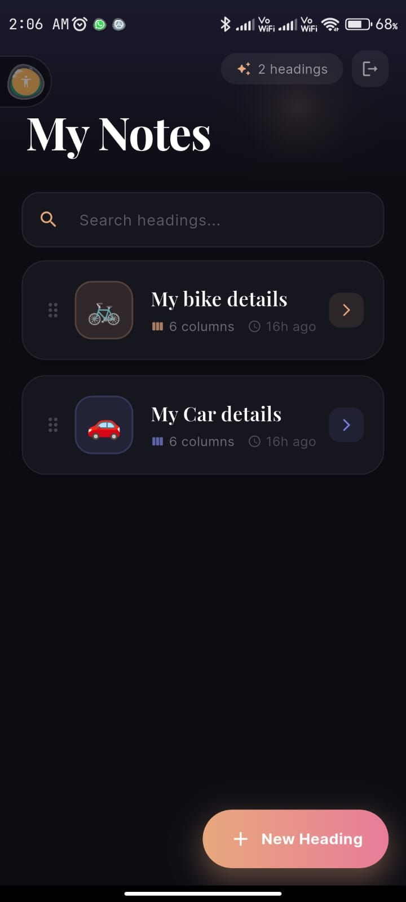
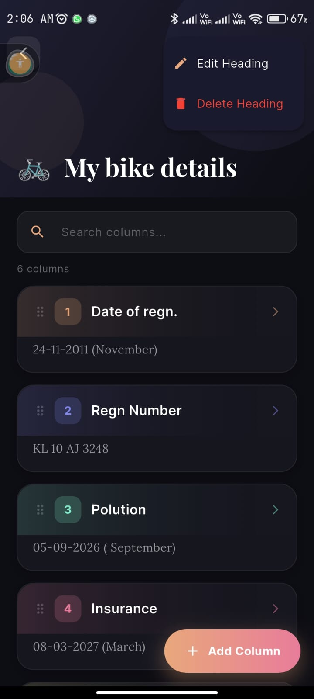
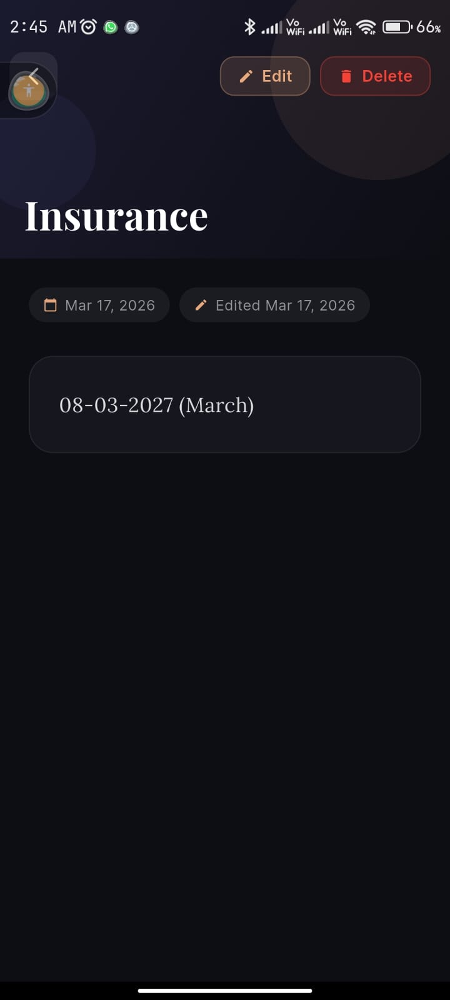

# 📝 Flutter Notes App

A beautiful cross-platform Notes app built with Flutter & Firebase.

🌐 **Live:** [my-notes-app-bcec4.web.app](https://my-notes-app-bcec4.web.app)

---

## ✨ Features
- 🔐 Email/Password Authentication
- 📋 Headings & Columns with full text content
- 🔍 Live search across headings and columns
- ↕️ Drag & drop reordering saved to Firebase
- 📴 Offline support with auto sync
- 🌐 Android • iOS • Web • Windows

---

## 🛠️ Built With
`Flutter` `Dart` `Firebase Firestore` `Firebase Auth` `Provider` `Firebase Hosting`

---

## 👨‍💻 Author
**Zain** • zainu716@gmail.com

## 📱 Screenshots

| Login | Home | Columns | Detail |
|---|---|---|---|
|  |  |  |  |
